# soc_thermometer_micriumos

实验环境：

* Simplicity Studio - SV5.0.2.1
* Gecko Platform - 3.0.2
* Bluetooth SDK - 3.0.2.0
* Micrium OS - 5.9.2
* GNU ARM Toolchain (v7.2.2017.q4) - 7.2.2017.q4
* Wireless Starter Kit Mainboard (BRD4001A Rev A01)
* EFR32MG12 2.4 GHz 19 dBm Radio Board (BRD4161A Rev A02)

# 1. 首次构建并运行

在 Simplicity Studio 中构建项目并将其刷写到设备上。在 Debug Adapters 视图中右键设备并点击 Connect，然后再右键该设备并点击 Launch Console。在打开的页面中选中 Serial 1 页（这是开发板的串口输出界面）。输入 `hello` 后，将获得以下输出：

```
> hello
Bluetooth public device address: 90:FD:9F:19:B8:0F
```

在 Debug Adapters 视图中右键设备并点击 Start capture 以打开 Network Analyzer（一个抓包工具，用于分析网络数据包）。此时界面应该是这样的：


在手机端使用 EFR Connect App 连接开发设备：


当 App 连接上开发设备时，可以在 Network Analyzer 中观察到一些变化。


并且 Serial 1 页会输出如下：

```
Connection opened
Temperature: 29.43 C
Temperature: 29.44 C
Temperature: 29.44 C

......
```

当关闭 App 后，连接将会断开，此时 Serial 1 页会输出如下：

```
Connection closed
Started advertising
```

观察 Network Analyzer 中的变化，发现设备的确在 advertising：


# 2. 从 main 出发

以下是 soc_thermometer_micriumos 的基本组织结构：

```
├─ autogen                              # 包含用于初始化硬件和处理事件的源码，还有一部分由代码生成工具自动生成的源码
├─ config                               # 配置选项相关源码，一般包含硬件、组件和协议栈配置选项
├─ gecko_sdk_3.0.0                      # Gecko SDK 源码，包含一些常用功能、开发板相关硬件、平台功能和协议栈等源码
├─ GNU ARM v7.2.1 - Debug               # GNU ARM 编译输出结果
├─ app.c                                # 用户应用程序源文件
├─ app.h                                # 提供用户应用程序接口给 main 函数的头文件
├─ app_properties.c                     # 包含应用程序属性结构，该结构包含有关应用程序映像的信息（如类型、版本和安全性等）
├─ create_bl_files.bat                  # 用于创建 UART DFU 升级映像（GBL 文件）的脚本。（Windows）
├─ create_bl_files.sh                   # 用于创建 UART DFU 升级映像（GBL 文件）的脚本。（Linux/Mac）
├─ main.c                               # main 函数的源文件
├─ soc_thermometer_micriumos.pintool    # Pin Tool 工具配置文件，可以用来配置引脚及外设功能
└─ soc_thermometer_micriumos.slcp       # 项目配置器的配置文件，可以用来配置项目（包括目标/SDK、工具链及组件等）
```

在 `main.c` 中， `main` 函数的实现如下：

```c
int main(void)
{
  // Initialize Silicon Labs device, system, service(s) and protocol stack(s).
  // Note that if the kernel is present, processing task(s) will be created by
  // this call.
  sl_system_init();

  // Initialize the application. For example, create periodic timer(s) or
  // task(s) if the kernel is present.
  app_init();

#if defined(SL_CATALOG_KERNEL_PRESENT)
  // Start the kernel. Task(s) created in app_init() will start running.
  sl_system_kernel_start();
#else // SL_CATALOG_KERNEL_PRESENT
  while (1) {
    // Do not remove this call: Silicon Labs components process action routine
    // must be called from the super loop.
    sl_system_process_action();

    // Application process.
    app_process_action();

#if defined(SL_CATALOG_POWER_MANAGER_PRESENT)
    // Let the CPU go to sleep if the system allows it.
    sl_power_manager_sleep();
#endif
  }
#endif // SL_CATALOG_KERNEL_PRESENT
}
```

`sl_system_init()` 负责初始化设备、系统、服务和协议栈：

```c
void sl_system_init(void)
{
  sl_platform_init();     // 初始化芯片、时钟、电源管理单元和系统（如果有）等
  sl_driver_init();       // 初始化外设，在组件配置器中配置的外设功能将在此初始化
  sl_service_init();      // 初始化一些实用服务，如标准 IO 流、加密、CLI 等
  sl_stack_init();        // 初始化协议栈，如果启用了系统组件则在此处创建协议栈相关的任务
  sl_internal_app_init(); // 初始化内部应用，目前为空
}
```

`app_init()` 负责初始化应用程序，如果启用了系统组件则应该在其中创建任务（如果需要）：

```c
SL_WEAK void app_init(void)
{
  sl_app_log("health thermometer initialised\n");
  // Init temperature sensor.
  sl_sensor_rht_init();
}
```

`SL_WEAK` 实际上是一个弱定义声明，可以定义同名函数来覆盖这个弱定义。

`sl_system_kernel_start()` 负责启动系统内核。

由于现在控制权已经交给了内核，所以应该跳转到内核任务分支继续探索代码。回头观察 `main -> sl_system_init -> sl_stack_init -> sl_bt_rtos_init` ，可以发现源码在此创建了任务 “Bluetooth Task”：

```c
void BluetoothTask(void *p_arg)
{
  (void)p_arg;

  RTOS_ERR      os_err;
  OS_FLAGS      flags = SL_BT_RTOS_EVENT_FLAG_EVT_HANDLED;

  sl_bt_init();

  sli_bt_set_cmd_handler_delegate(sli_bt_cmd_handler_rtos_delegate);
  sl_bt_rtos_create_tasks();
  while (DEF_TRUE) {
    //Command needs to be sent to Bluetooth stack
    if (flags & SL_BT_RTOS_EVENT_FLAG_CMD_WAITING) {
      uint32_t header = command_header;
      sl_bt_handler cmd_handler = command_handler_func;
      sli_bt_cmd_handler_delegate(header, cmd_handler, (void*)command_data);
      command_handler_func = NULL;
      flags &= ~SL_BT_RTOS_EVENT_FLAG_CMD_WAITING;
      OSFlagPost(&bluetooth_event_flags, (OS_FLAGS)SL_BT_RTOS_EVENT_FLAG_RSP_WAITING, OS_OPT_POST_FLAG_SET, &os_err);
    }

    //Bluetooth stack needs updating, and evt can be used
    if (sl_bt_event_pending() && (flags & SL_BT_RTOS_EVENT_FLAG_EVT_HANDLED)) {  //update bluetooth & read event
      sl_status_t status = sl_bt_pop_event(bluetooth_evt);
      APP_RTOS_ASSERT_DBG(status != SL_STATUS_INVALID_PARAMETER, 1);
      OSFlagPost(&bluetooth_event_flags, (OS_FLAGS)SL_BT_RTOS_EVENT_FLAG_EVT_WAITING, OS_OPT_POST_FLAG_SET, &os_err);
      flags &= ~SL_BT_RTOS_EVENT_FLAG_EVT_HANDLED;
    }

    uint32_t timeout = sli_bt_can_sleep_ticks();
    if (timeout == 0 && (flags & SL_BT_RTOS_EVENT_FLAG_EVT_HANDLED)) {
      continue;
    }
    flags |= OSFlagPend(&bluetooth_event_flags,
                        (OS_FLAGS)SL_BT_RTOS_EVENT_FLAG_STACK + SL_BT_RTOS_EVENT_FLAG_EVT_HANDLED + SL_BT_RTOS_EVENT_FLAG_CMD_WAITING,
                        0,
                        OS_OPT_PEND_BLOCKING + OS_OPT_PEND_FLAG_SET_ANY + OS_OPT_PEND_FLAG_CONSUME,
                        NULL,
                        &os_err);
    // flag_stack is used to wakeup from pend and then sl_bt_event_pending() is used to check if event is queued
    // even if event stays in queue and task again sleeps, it is woke up by evt_handled and then it can be processed.
  }
}
```

`sl_bt_init()` 负责初始化和配置协议栈，由于其所调用的是协议栈库的函数（闭源），所以这里只能根据函数名来判断其功能：

```c
void sl_bt_init(void)
{
  sl_bt_init_stack(&config);
  sl_bt_class_system_init();
  sl_bt_class_advertiser_init();
  sl_bt_class_gap_init();
  sl_bt_class_scanner_init();
  sl_bt_class_connection_init();
  sl_bt_class_gatt_init();
  sl_bt_class_gatt_server_init();
  sl_bt_class_nvm_init();
  sl_bt_class_sm_init();
}
```

`sli_bt_set_cmd_handler_delegate(sli_bt_cmd_handler_rtos_delegate)` 将 `sli_bt_cmd_handler_rtos_delegate` 函数设为命令处理器函数。其实现同样是闭源的。

接下来，调用 `sl_bt_rtos_create_tasks()` 创建了两个任务 “Linklayer Task” 和 “Bluetooth Event Task”：

```c
static void sl_bt_rtos_create_tasks()
{
  RTOS_ERR os_err;

  //create tasks for Linklayer

  OSTaskCreate(&LinklayerTaskTCB,
               "Linklayer Task",
               LinklayerTask,
               0u,
               SL_BT_RTOS_LL_PRIORITY,
               &LinklayerTaskStk[0u],
               LINKLAYER_STACK_SIZE / 10u,
               LINKLAYER_STACK_SIZE,
               0u,
               0u,
               0u,
               (OS_OPT_TASK_STK_CHK | OS_OPT_TASK_STK_CLR),
               &os_err);

  //create tasks for Bluetooth event handler
#ifndef SL_BT_DISABLE_EVENT_TASK
  OSTaskCreate(&BluetoothEventTaskTCB,
               "Bluetooth Event Task",
               sl_bt_event_handler_task,
               0u,
               SL_BT_RTOS_EVENT_HANDLER_PRIORITY,
               &BluetoothEventTaskStk[0u],
               BLUETOOTH_EVENT_STACK_SIZE / 10u,
               BLUETOOTH_EVENT_STACK_SIZE,
               0u,
               0u,
               0u,
               (OS_OPT_TASK_STK_CHK | OS_OPT_TASK_STK_CLR),
               &os_err);
#endif
}
```

“Linklayer Task” 等待 `SL_BT_RTOS_EVENT_FLAG_LL` 标志，然后调用 `sl_bt_priority_handle()` （实现闭源，暂时不细究）：

```c
static  void  LinklayerTask(void *p_arg)
{
  RTOS_ERR      os_err;
  (void)p_arg;

  while (DEF_TRUE) {
    OSFlagPend(&bluetooth_event_flags, (OS_FLAGS)SL_BT_RTOS_EVENT_FLAG_LL,
               0,
               OS_OPT_PEND_BLOCKING + OS_OPT_PEND_FLAG_SET_ANY + OS_OPT_PEND_FLAG_CONSUME,
               NULL,
               &os_err);

    sl_bt_priority_handle();
  }
}
```

“Bluetooth Event Task” 等待 `SL_BT_RTOS_EVENT_FLAG_EVT_WAITING` 标志，然后调用 `sl_bt_process_event((sl_bt_msg_t*)bluetooth_evt)` 以处理事件，之后会设置 `SL_BT_RTOS_EVENT_FLAG_EVT_HANDLED` 标志：

```c
void  sl_bt_event_handler_task(void  *p_arg)
{
  RTOS_ERR      os_err;
  (void)p_arg;

  while (DEF_TRUE) {
    OSFlagPend(&bluetooth_event_flags, (OS_FLAGS)SL_BT_RTOS_EVENT_FLAG_EVT_WAITING,
               0,
               OS_OPT_PEND_BLOCKING + OS_OPT_PEND_FLAG_SET_ANY + OS_OPT_PEND_FLAG_CONSUME,
               NULL,
               &os_err);
    sl_bt_process_event((sl_bt_msg_t*)bluetooth_evt);

    OSFlagPost(&bluetooth_event_flags, (OS_FLAGS)SL_BT_RTOS_EVENT_FLAG_EVT_HANDLED, OS_OPT_POST_FLAG_SET, &os_err);
  }
}
```

在 `sl_bt_process_event()` 的定义处，可以看到以下内容：

```c
SL_WEAK void sl_bt_on_event(sl_bt_msg_t* evt)
{
  (void)(evt);
}

void sl_bt_process_event(sl_bt_msg_t *evt)
{
  sl_bt_ota_dfu_on_event(evt);
  sl_bt_ht_on_event(evt);
  sl_bt_on_event(evt);
}
```

`sl_bt_ota_dfu_on_event()` 用于处理 OTA DFU 事件。 `sl_bt_ht_on_event()` 用于处理 Health Thermometer GATT 的相关事件。这里对用户最重要的是 `sl_bt_on_event()` 。在 `sl_bt_process_event()` 的定义处， `sl_bt_on_event()` 被实现为一个弱定义，在 `app.c` 中，定义了一个同名的 `sl_bt_on_event` 来覆盖该弱定义，用户可以在该函数中处理协议栈事件。

现在，基本上把整个应用程序走了一遍，接下来将编写一些自定义的功能来进行更深入的探讨。

# 3. 添加 LED1 并为其实现 Bluetooth 控制功能

## 3.1 添加 LED1 驱动

在 Simplicity Studio 中的 Project Explorer 下双击项目的 `.slcp` 文件可以打开项目配置器，这是一个用于配置项目设置和组件的可视化工具。

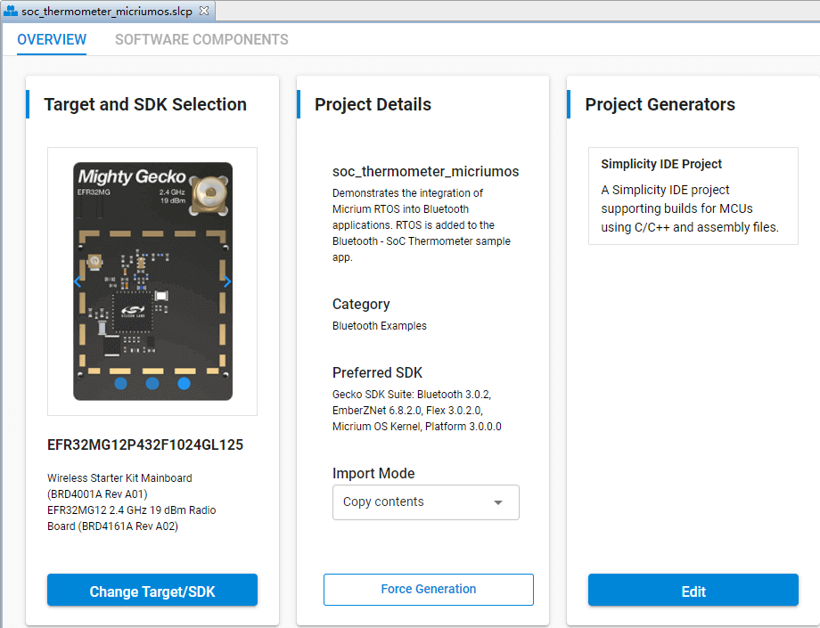

点击 SOFTWARE COMPONENTS 选项卡以切换到组件配置，并在搜索框上输入 led 以搜素相关组件：

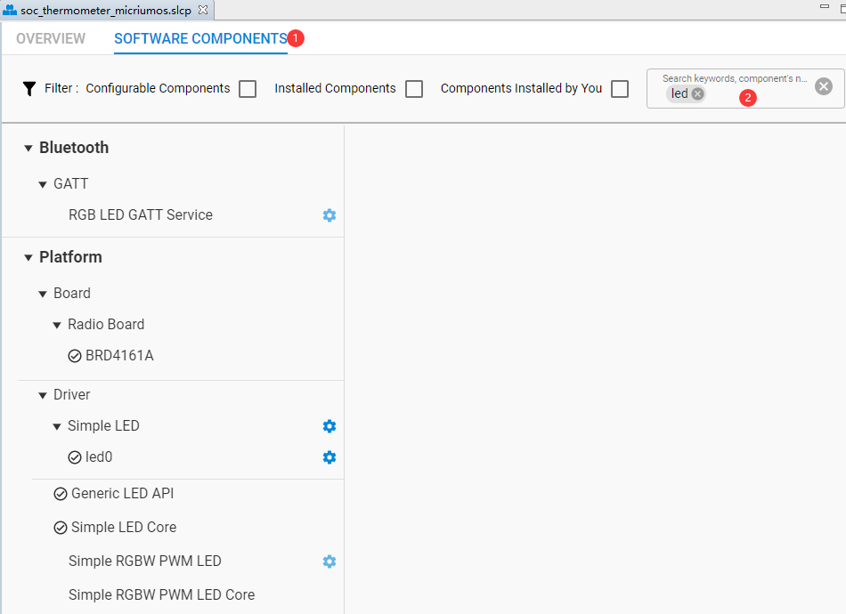

选中 Platform > Driver > Simple LED，并点击 Add New Instances 按钮以添加一个实例，命名实例名为 led1：

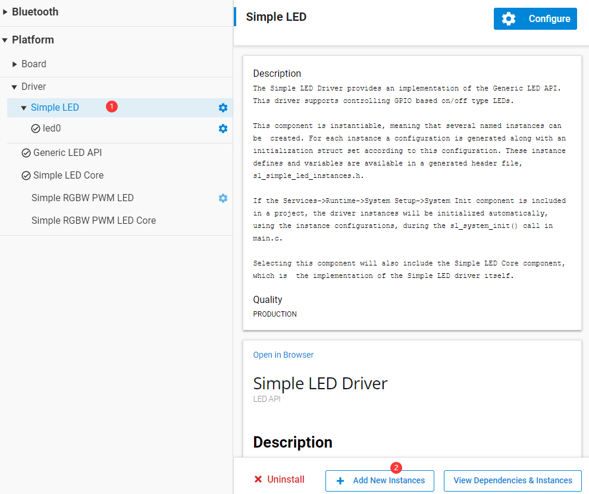

根据无线板原理图 [BRD4161A-A02-schematic.pdf](docs/BRD4161A-A02-schematic.pdf)，可得知 LED1 使用的是 PF5 引脚：

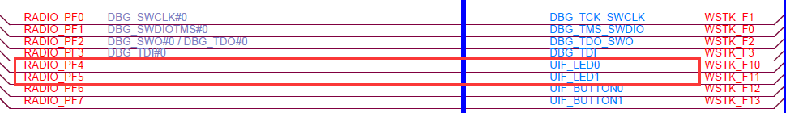

根据主板原理图 [BRD4001A-A01-schematic.pdf](docs/BRD4001A-A01-schematic.pdf)，可得知 LED1 是高电平点亮的：

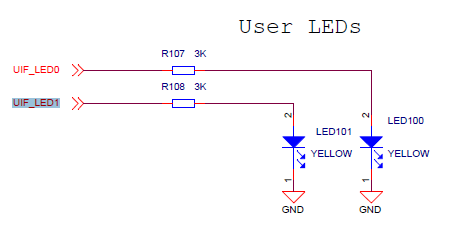

点击 Platform > Driver > Simple LED > led1 的配置按钮：

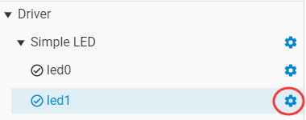

在打开的 Simple LED (led1) 页面上配置 LED1 的属性：

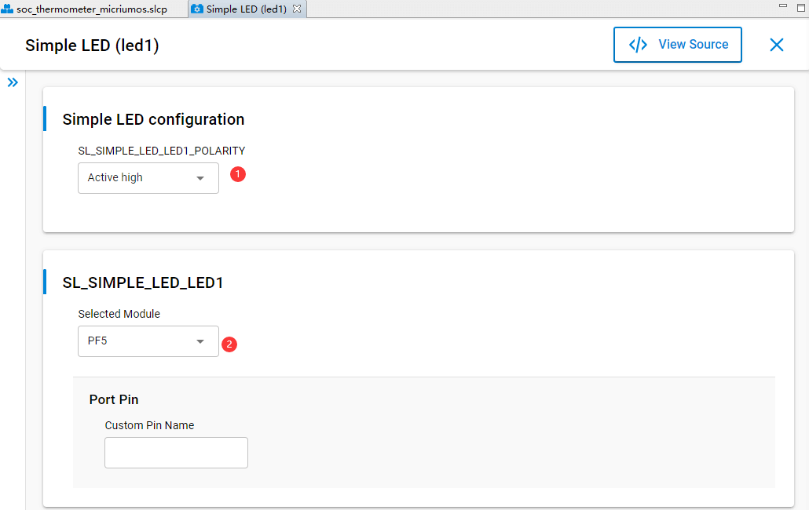

配置完成后，项目配置器会自动生成及更改相应的代码源文件，主要是：

* `autogen/sl_component_catalog.h`
* `autogen/sl_simple_led_instances.c`
* `autogen/sl_simple_led_instances.h`

## 3.2 为 LED1 添加 Bluetooth GATT 项

在 SOFTWARE COMPONENTS 选项卡中的搜索框上输入 gatt 以搜素相关组件：

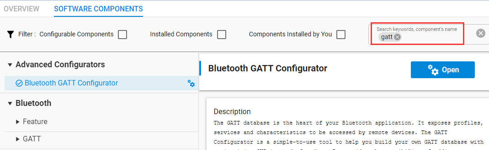

点击 Advanced Configurators > Bluetooth GATT Configurator 的配置按钮以打开 GATT 配置器：


选中 Custom BLE GATT Profile，然后点击添加按钮以创建一个 Service：

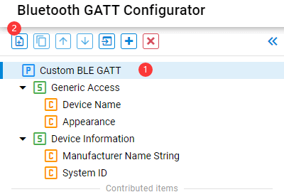

选中新建的 Service，并修改其具体信息，这里将其命名为 LED Control：

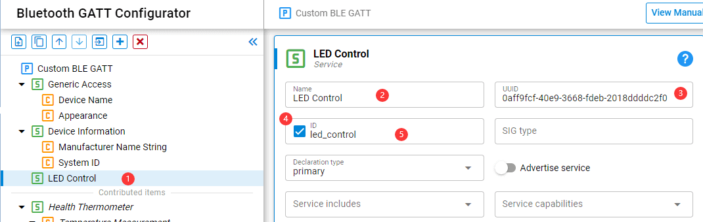

选中 LED Control Service，然后点击添加按钮以创建一个 Characteristic，并修改其具体信息，这里将其命名为 On/Off：

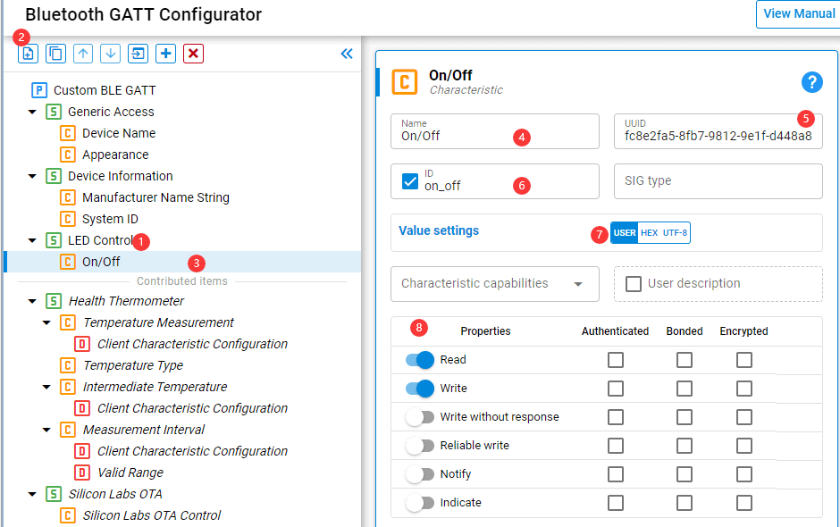

点击保存后 GATT 配置器将自动生成相应的代码源文件。

> 注：GATT 配置器并不会像项目配置器一样自动保存，所以需要手动保存后才会自动生成代码。

生成的主要代码为：

* `autogen/gatt_db.c`
* `autogen/gatt_db.h`

## 3.3 编写相应代码

由于我们使用组件配置器添加 LED1 的驱动，所以我们无需手动初始化（自动生成的组件代码会为驱动执行初始化）。

在 [2. 从 main 出发](#2-从-main-出发) 中得知，我们应该在 `app.c` 的 `sl_bt_on_event()` 函数中处理协议栈的事件。从 switch 语句的 case `sl_bt_evt_system_boot_id` 跳转，这将跳转到 `gecko_sdk_3.0.0/protocol/bluetooth/inc/sl_bt_types.h` ，可以发现协议栈事件的 id 都在这里定义。在其中找到我们需要的事件 id：

```c
#define sl_bt_evt_gatt_server_user_write_request_id                  0x020a00a0
#define sl_bt_evt_gatt_server_user_read_request_id                   0x010a00a0
```

之后，我们在 switch 语句中添加我们对这两个事件的处理：

```c
///////////////////////////////////////////////////////////////////////////
// Add additional event handlers here as your application requires!      //
///////////////////////////////////////////////////////////////////////////
case sl_bt_evt_gatt_server_user_write_request_id:
  if (evt->data.evt_gatt_server_user_write_request.characteristic == gattdb_on_off) { // 写入的是否 On/Off Characteristic
    if (evt->data.evt_gatt_server_user_write_request.value.data[0]) {                 // 写入的单字节数据值
      sl_led_turn_on(&sl_led_led1);  // LED1 ON
    } else {
      sl_led_turn_off(&sl_led_led1); // LED1 OFF
    }
    // 发送写响应
    sl_bt_gatt_server_send_user_write_response(evt->data.evt_gatt_server_user_write_request.connection,
                                               evt->data.evt_gatt_server_user_write_request.characteristic,
                                               0);
  }
  break;

case sl_bt_evt_gatt_server_user_read_request_id:
  if(evt->data.evt_gatt_server_user_read_request.characteristic == gattdb_on_off) {
    // 读 LED1 的状态
    sl_led_state_t led_state = sl_led_get_state(&sl_led_led1);
    uint16_t sent_len = 0;
    // 发送读响应
    sl_bt_gatt_server_send_user_read_response(evt->data.evt_gatt_server_user_read_request.connection,
                                              evt->data.evt_gatt_server_user_read_request.characteristic,
                                              0,
                                              1,
                                              &led_state,
                                              &sent_len);
  }
  break;
```

保存并编译项目，然后将其刷写到设备上。

使用 App 写入 0/1 到 On/Off Characteristic，可以观察到主板上的 LED1 发生变化：


