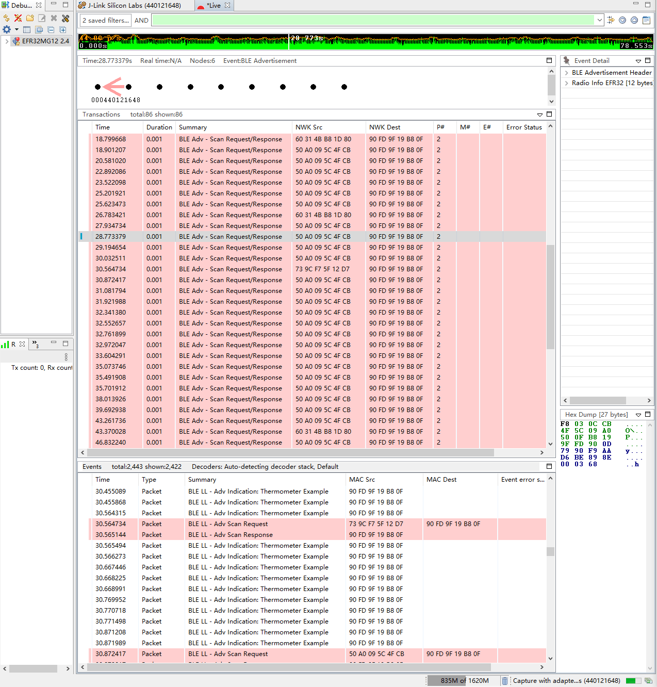
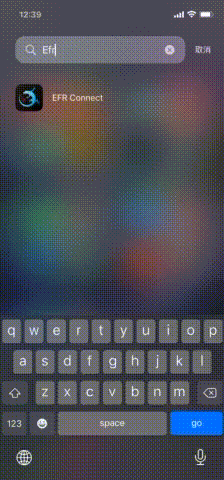
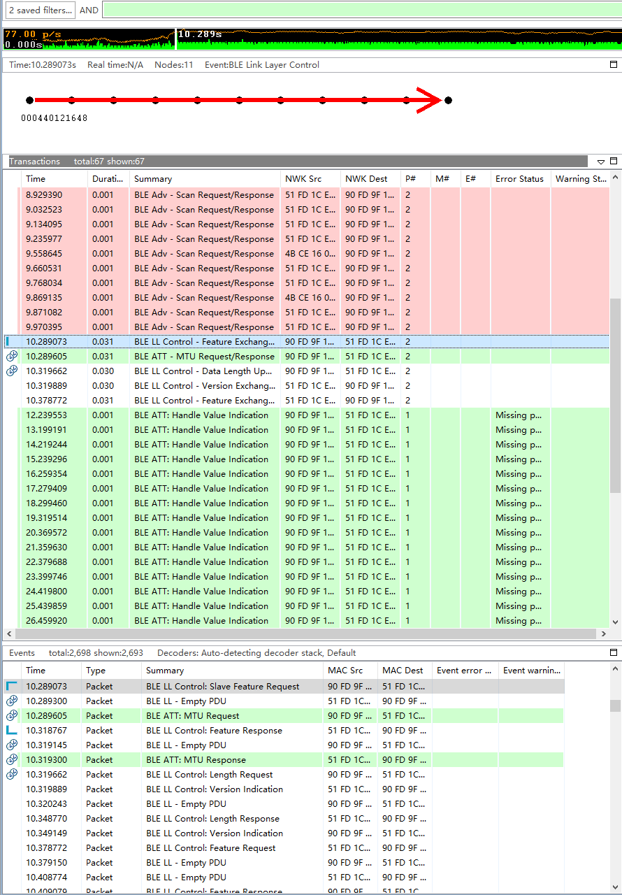
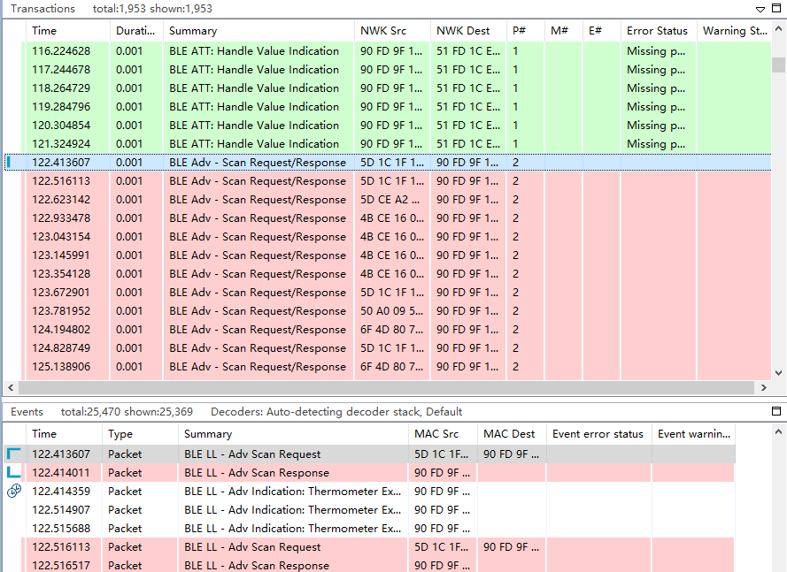

# soc_thermometer_micriumos

实验环境：

* Simplicity Studio - SV5.0.2.1
* Gecko Platform - 3.0.2
* Bluetooth SDK - 3.0.2.0
* Micrium OS - 5.9.2
* GNU ARM Toolchain (v7.2.2017.q4) - 7.2.2017.q4
* Wireless Starter Kit Mainboard (BRD4001A Rev A01)
* EFR32MG12 2.4 GHz 19 dBm Radio Board (BRD4161A Rev A02)

# 1. 首次构建并运行

在 Simplicity Studio 中构建项目并将其刷写到设备上。在 Debug Adapters 视图中右键设备并点击 Connect，然后再右键该设备并点击 Launch Console。在打开的页面中选中 Serial 1 页（这是开发板的串口输出界面）。输入 `hello` 后，将获得以下输出：

```
> hello
Bluetooth public device address: 90:FD:9F:19:B8:0F
```

在 Debug Adapters 视图中右键设备并点击 Start capture 以打开 Network Analyzer（一个抓包工具，用于分析网络数据包）。此时界面应该是这样的：



在手机端使用 EFR Connect App 连接开发设备：



当 App 连接上开发设备时，可以在 Network Analyzer 中观察到一些变化。



并且 Serial 1 页会输出如下：

```
Connection opened
Temperature: 29.43 C
Temperature: 29.44 C
Temperature: 29.44 C

......
```

当关闭 App 后，连接将会断开，此时 Serial 1 页会输出如下：

```
Connection closed
Started advertising
```

观察 Network Analyzer 中的变化，发现设备的确在 advertising：


